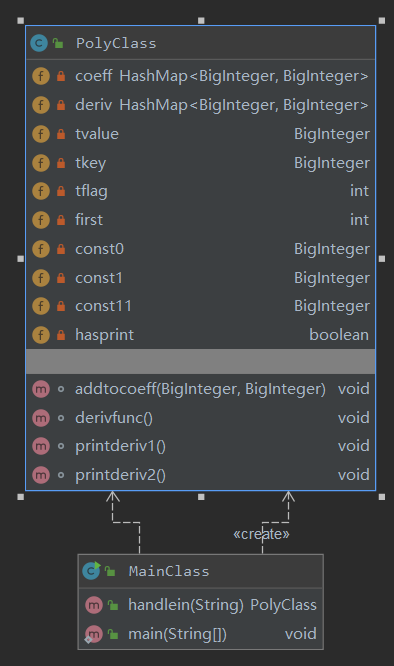
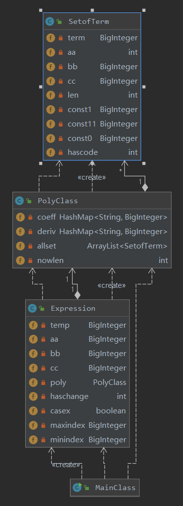
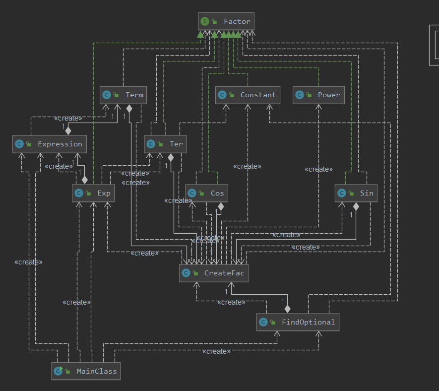

# OO第一单元总结-表达式求导
### 第一次作业
#### 类图：

#### 耦合度：

在第一次作业中，因为题目相对简单，所以没有考虑可拓展性以及面向对象的方法，几乎是使用了面向过程的方法导致耦合度高。主要是因为对正则表达式应用的不熟练所导致的。
可重构的思路：其中发现可以在创建表达式对象（polyclass）的时候可以直接运用构造函数构造，而不是用一种面向过程的方式进行创建，很多处理都可以放在构造函数中，可以做到高内聚低耦合的原则。并且在输出的时候可以采取对指数抽象的输出，而不是在方法中不断地应用if-else语句进行选择性的输出。
### 第二次作业
#### 类图：

#### 耦合度：

在这次作业中，稍微有了一点面向对象的思维，分别创建了管理表达式、多项式、项的类，但是抽象的还不够好，没有讲因子抽象出来，而是整个都放入了项和多项式中。这次耦合度主要是因为优化所以偏高。优化采用的是分拆的思想。
可重构的思路：首先可以将对表达式的处理全部放入表达式类中，并且对于优化方面应该另外创建一个类，使得代码逻辑更加清晰。在创建对象方面仍然使用了大量的if-else语句，其实可以通过工厂模式或者构造函数的方式解决。
### 第三次作业
#### 类图：

#### 耦合度：

首先这次作业我采用了工厂模式，抽象出了表达式，项，各种因子，优化类，在类的内部自行管理，但是因为在各类中还是没有做到低耦合的思想，这是因为在写类中的方法的时候还是面向对过程的思想，并没有将其更好的抽象出来，并且可以看见在上面的类图中，Exp,Expression完全可以用一个类替代，但是因为边写代码边改的问题，导致了冗余，希望下次能够做好架构在写代码。
可重构的思路：做好架构，在创建对象方面，可以采用递归式的构造思路，不仅可以很快的实现优化，还可以顺便判断一些错误的输入。
### bug分析
第一次和第二次作业在公测和互测中均为出现错误，在第三次作业中出现了两个bug，一个是WF的误判，一个是x求导时候的错误，这些错误其实都是很好避免的，但是因为架构原因，导致自己在读自己的代码时没有耐心。第三次公测出现两处bug，互测未出现错误。
在互测阶段，第一次和第二次我都采用的是直接黑盒测试的方式，然后对边界数据直接进行提交hack，几乎没有结合代码进行hack，第三次，采用的是读代码的方式进行hack，通过对TLE以及边界数据的判断，取得了较好的结果。
在自己写代码的阶段，一定要构造测试集，多做一些测试，这样不仅可以在编写代码的时候找到bug，并且能够提高debug的效率，尤其是在第三次作业中，一不小心就会出现巨大错误，并且希望能够在编写代码以后，重新对代码进行回顾思考。在自己测试时，采用了边界数据和黑盒测试同时使用的方式。
### 感想与对比
在第一单元的学习中，对面向对象有了一定的了解，但是从耦合度可以看出，自己仍然与面向对象还有很远的距离，并且在第三次作业中因为自己的一些不细心导致了一些错误，略有不甘，希望能够在第二单元的学习中能够领悟到面向对象的真谛。
当然在做作业时最困难的就是架构以及优化，优化所花的时间总是最多的，在第三次作业过后通过与满分大佬优化的交流，发现自己在架构以及设计方面还有很大的进步空间，希望能够继续和大佬们学习更多的设计思路以及优化思想。

