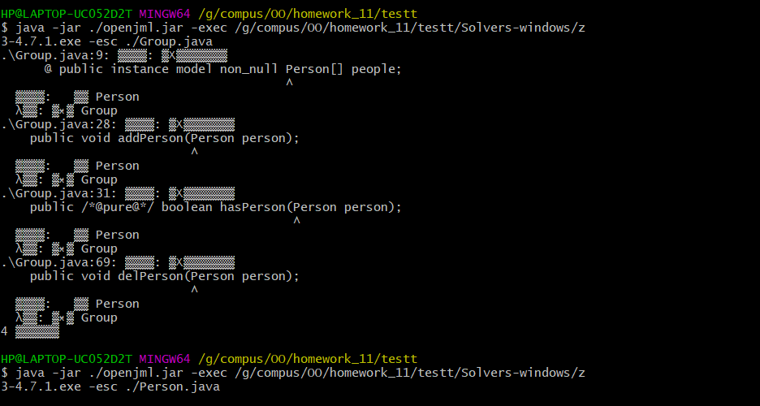

# OO第三单元总结-JML
## JML理论基础
### 1.定义：
JML(Java Modeling Language)是用于对Java程序进行规格化设计的一种表示语言。JML是一种行为接口规格语言（Behavior Interface Specification Language，BISL），基于Larch方法构建。JML可以用于开展规格化设计和提升代码可维护性。
### 2.常见用法：
- JML表达式：
	- 原子表达式：
**\\result**:表示一个非 void 类型的方法执行所获得的结果，即方法执行后的返回值。
**\\old(expr)**:用来表示一个表达式expr在相应方法执行前的取值，需要注意类似v.size(),\old(v).size()以及\old(v.size())之间的区别。
**\\not_assigned(x,y,...)**:用来表示括号中的变量是否在方法执行过程中被赋值。如果没有被赋值则返回true，否则返回false。
**\\not_modified(x,y,...)**:与上面的\not_assigned表达式类似，该表达式限制括号中的变量在方法执行期间的取值未发生变化。
**\\nonnullelements(container)**:表示container对象中存储的对象不会有null。
**\\type(type)**:返回类型type对象的类型（class）。
**\\typeof(expr)**:该表达式返回expr对应的准确类型。
	- 量化表达式：
**\\forall**:全称量词修饰的表达式，表示对于给定范围内的元素，每个元素都满足相应的约束。
**\\exists**:存在量词修饰的表达式，表示给定范围内的元素，存在某个元素满足相应的约束。
**\\sum**:返回给定范围内的表达式的和。
**\\product**:返回给定范围内的表达式的连乘的结果。
**\\max**:返回给定范围内的表达式的最大值。
**\\min**:返回给定范围内的表达式的最小值。
**\\num_of**:返回指定变量中满足相应条件的取值个数。
- 方法规格:
	- 前置条件：通过**requires**子句来表示：requires P。其中requires是JML的关键字，表达的意思是“要求调用者确保P为真”(在这一单元的作业中，有些方法的规格并不完整，并没有给出所有的调用情况，当有不满足条件的调用时，应该直接return)。
	- 后置条件：通过**ensures**子句来表示：ensures P；其中ensures是JML关键字，表达的意思是“方法实现者确保方法执行返回结果一定满足谓词P的要求，即确保P为真”。
	- 副作用范围限定：使用**assignable**或者**modifiable**。指方法在执行过程中会修改对象的属性数据或者类的静态成员数据，从而给后续方法的执行带来影响。
	- 异常行为：用**signal**或者**signal_only**子句：signals子句强调在对象状态满足某个条件时会抛出符合相应类型的异常；而signals_only则不强调对象状态条件，强调满足前置条件时抛出相应的异常。
- 类型规格：
	- 不变式**invariant**：要求在所有可见状态下都必须满足的特性。
	- 状态变化约束**constraint**：对前序可见状态和当前可见状态的关系进行约束。
- 举例说明：
```java
/*@ public normal_behavior        			//表示正常行为

      @ requires !(\exists int i; 0 <= i && i < people.length; people[i].equals(person));       		//前置条件，在people容器中不存在person时。
      
      @ assignable people, money;  		//people和money两个变量可以被修改
      
      @ ensures people.length == \old(people.length) + 1;   //people容器大小加1
      
      @ ensures money.length == people.length;   //money大小等于people大小
      
      @ ensures (\forall int i; 0 <= i && i < \old(people.length); 
      @         (\exists int j; 0 <= j && j < people.length; 
      @         people[j] == \old(people[i]) && money[j] == \old(money[i])));
      //后置条件，对任意的一个在原来people容器中的person，都在新的people容器中存在一个对应，且money也对应。
      
      @ ensures (\exists int i; 0 <= i && i < people.length; people[i] == person && money[i] == 0); //后置条件，表示在新的容器中存在person，且其对应的money为0
      
      @ also
      @ public exceptional_behavior //表示异常行为
      
      @ signals (EqualPersonIdException e) (\exists int i; 0 <= i && i < people.length; people[i].equals(person));  //signal子句，表示在people已经存在person时抛出异常。
      @*/
```
### 3.JML应用工具链：
**OpenJML**：使用OpenJML可以对JML代码实现静态语法检查和运行时检查。
**JMLUnitNG**：根据JML语言自动生成TestNG测试文件检查代码正确性。
**JMLUnit**：根据JML语言构造测试方法和测试用例，检查相应JML规格和代码实现的正确性。
- OpenJML的使用:
  
  在检查Person类的时候没有出现错误，但是在检查Group类的时候可能因为没有检测到Person，所以失败了。

- JMLUnitNG测试部署：

  ```java
  java -jar jmlunitng.jar MyGroup.java
  javac -cp jmlunitng.jar *.java
  java -cp jmlunitng.jar MyGroup_JML_Test
  ```
  
  使用上述代码生成测试样例。
  
  测试结果如下:
  
  ```
  [TestNG] Running:
    Command line suite
  
  Failed: racEnabled()
  Passed: constructor MyGroup(-2147483648)
  Passed: constructor MyGroup(0)
  Passed: constructor MyGroup(2147483647)
  Failed: <<MyGroup@6842775d>>.addPerson(null)
  Failed: <<MyGroup@574caa3f>>.addPerson(null)
  Failed: <<MyGroup@1761e840>>.addPerson(null)
  Passed: <<MyGroup@6c629d6e>>.addRelation(-2147483648, -2147483648)
  Passed: <<MyGroup@5ecddf8f>>.addRelation(-2147483648, -2147483648)
  Passed: <<MyGroup@3f102e87>>.addRelation(-2147483648, -2147483648)
  Passed: <<MyGroup@27abe2cd>>.addRelation(0, -2147483648)
  Passed: <<MyGroup@5f5a92bb>>.addRelation(0, -2147483648)
  Passed: <<MyGroup@6fdb1f78>>.addRelation(0, -2147483648)
  Passed: <<MyGroup@51016012>>.addRelation(2147483647, -2147483648)
  Passed: <<MyGroup@29444d75>>.addRelation(2147483647, -2147483648)
  Passed: <<MyGroup@2280cdac>>.addRelation(2147483647, -2147483648)
  Passed: <<MyGroup@1517365b>>.addRelation(-2147483648, 0)
  Passed: <<MyGroup@4fccd51b>>.addRelation(-2147483648, 0)
  Passed: <<MyGroup@44e81672>>.addRelation(-2147483648, 0)
  Passed: <<MyGroup@60215eee>>.addRelation(0, 0)
  Passed: <<MyGroup@4ca8195f>>.addRelation(0, 0)
  Passed: <<MyGroup@61baa894>>.addRelation(0, 0)
  Passed: <<MyGroup@768debd>>.addRelation(2147483647, 0)
  Passed: <<MyGroup@490d6c15>>.addRelation(2147483647, 0)
  Passed: <<MyGroup@7d4793a8>>.addRelation(2147483647, 0)
  Passed: <<MyGroup@449b2d27>>.addRelation(-2147483648, 2147483647)
  Passed: <<MyGroup@5479e3f>>.addRelation(-2147483648, 2147483647)
  Passed: <<MyGroup@27082746>>.addRelation(-2147483648, 2147483647)
  Passed: <<MyGroup@66133adc>>.addRelation(0, 2147483647)
  Passed: <<MyGroup@7bfcd12c>>.addRelation(0, 2147483647)
  Passed: <<MyGroup@42f30e0a>>.addRelation(0, 2147483647)
  Passed: <<MyGroup@24273305>>.addRelation(2147483647, 2147483647)
  Passed: <<MyGroup@5b1d2887>>.addRelation(2147483647, 2147483647)
  Passed: <<MyGroup@46f5f779>>.addRelation(2147483647, 2147483647)
  Failed: <<MyGroup@1c2c22f3>>.delPerson(null)
  Failed: <<MyGroup@18e8568>>.delPerson(null)
  Failed: <<MyGroup@33e5ccce>>.delPerson(null)
  Passed: <<MyGroup@5a42bbf4>>.equals(null)
  Passed: <<MyGroup@270421f5>>.equals(null)
  Passed: <<MyGroup@4f4a7090>>.equals(null)
  Passed: <<MyGroup@18ef96>>.equals(java.lang.Object@6956de9)
  Passed: <<MyGroup@769c9116>>.equals(java.lang.Object@6aceb1a5)
  Passed: <<MyGroup@2d6d8735>>.equals(java.lang.Object@ba4d54)
  Passed: <<MyGroup@12bc6874>>.getAgeMean()
  Passed: <<MyGroup@de0a01f>>.getAgeMean()
  Passed: <<MyGroup@4c75cab9>>.getAgeMean()
  Passed: <<MyGroup@1ef7fe8e>>.getAgeVar()
  Passed: <<MyGroup@6f79caec>>.getAgeVar()
  Passed: <<MyGroup@67117f44>>.getAgeVar()
  Passed: <<MyGroup@5d3411d>>.getConflictSum()
  Passed: <<MyGroup@2471cca7>>.getConflictSum()
  Passed: <<MyGroup@5fe5c6f>>.getConflictSum()
  Passed: <<MyGroup@6979e8cb>>.getId()
  Passed: <<MyGroup@763d9750>>.getId()
  Passed: <<MyGroup@5c0369c4>>.getId()
  Passed: <<MyGroup@2be94b0f>>.getPeopleSize()
  Passed: <<MyGroup@d70c109>>.getPeopleSize()
  Passed: <<MyGroup@17ed40e0>>.getPeopleSize()
  Passed: <<MyGroup@50675690>>.getRelationSum()
  Passed: <<MyGroup@31b7dea0>>.getRelationSum()
  Passed: <<MyGroup@3ac42916>>.getRelationSum()
  Passed: <<MyGroup@47d384ee>>.getValueSum()
  Passed: <<MyGroup@2d6a9952>>.getValueSum()
  Passed: <<MyGroup@22a71081>>.getValueSum()
  Passed: <<MyGroup@3930015a>>.hasPerson(null)
  Passed: <<MyGroup@629f0666>>.hasPerson(null)
  Passed: <<MyGroup@1bc6a36e>>.hasPerson(null)
  
  ===============================================
  Command line suite
  Total tests run: 67, Failures: 7, Skips: 0
  ===============================================
  ```
  
  

从上面的测试样例可以看出，这个测试只是对边界情况进行了一些考虑，感觉这种方法还不如Junit以及对拍香，我更愿意选择对拍以及自动化测试进行验证，这个工具对极端情况还是能够做一个较好的分析。但是总体来说真的不知道这个有什么用处，极端情况的测试也并不完全。以上代码fail的都是因为不存在的情况。

## 作业分析
### 第一次作业：
本次作业没有什么难点，主要是熟悉JML语言，根据JML语言的语义进行实现就行，本次较为复杂的一个方法时iscircle，我采用了并查集的算法，时间复杂度较好。没有对架构采取什么改变，就是在原有的接口上实现自己的算法即可。
### 第二次作业：
在第一次作业的基础上加上了一个Group类，Group类的难点主要是在getRelationsum，getValue，getAgeMean，getAgeVar，这几个方法上，以getRelationsum和getAgeMean为例。（需要仔细阅读JML规格，搞清楚for循环到底是对那些进行遍历）
对于getRelationsum，这个值的改变只会在人加入group和加关系的时候，所以只用通过这两种情况进行考虑即可实现。
对于getAgeMean，可以用一个agesum来缓存当前group中所有人的age和，这样的话就可以实现O(1)询问。
### 第三次作业：
本次作业的难点主要是要知道两个新的算法，tarjan实现点双连通分量以及dij堆优化算法，主要的难点在于stronglink需要寻找点双连通分量，以及minpath找两个点的最小距离，还有qbs寻找当前连通块的个数（直接通过并查集O(n)实现）。
本次作业新加了一些类，主要是对图的数据进行管理，为了让代码更好看以及符合面向对象的要求。下附第三次作业的架构图：

## BUG分析
在这个单元的三次作业中，在第二作业中出现了一个小的BUG，即对规格中没有出现的情况的处理，本以为测试数据不会出现不满足requires的情况，并且以为测试的时候也不会超出requires的情况，但是在本单元的作业中，没有出现=直接return，导致出现了一个BUG。
本单元的hack，都是通过阅读代码进行hack，这也许就是JML的一个好处，因为都是实现同一个接口，所以大家的方法都大同小异，并且可读性较强，本单元仅在第二次作业的时候hack成功，主要错误是iscircle采用了暴力DFS算法，导致了TLE，还有就是对于getAgeMean的规格化描述理解的偏差，以及除0的错误。

## 心得体会
这个单元主要是学习了一种规格化的方法，JML语言主要就是对方法进行规格化描述，不仅仅方便了使用者也方便了实现者，并且通过此次的互测，我更加深刻的理解到了JML语言的好处，就是可以方便debug，可以清楚的知道架构，就可以更好的定位错误。
在这个单元的学习中，总感觉有点不那么OO，主要是因为第一二单元的体验极好，体会到了设计模式的重要性，以及线程安全的重要性，并且都是自己从头进行编程，可以训练架构以及对于OO各种原则的训练，对类的构建以及类的解耦等都有着很大的提升，感觉第三单元只是对JML语言的了解以及算法的了解，但是总体来说对于规格化的思想有了一定的了解，也是一种不一样的体验。
最后希望OO课程可以办的越来越好，希望能够更加OO。

