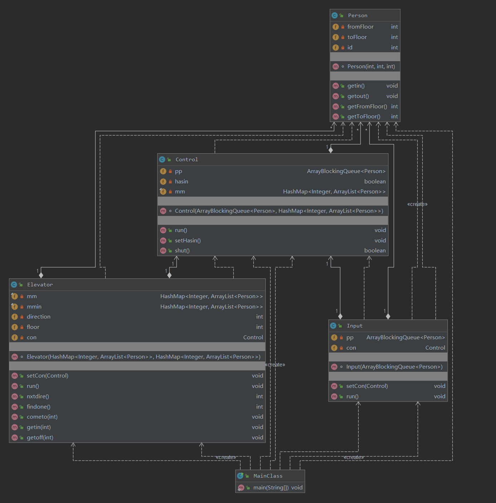
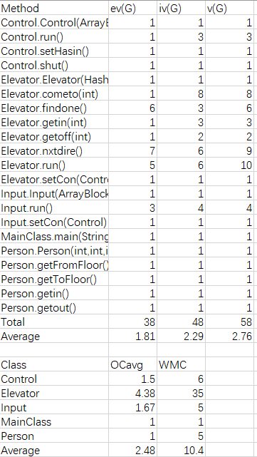
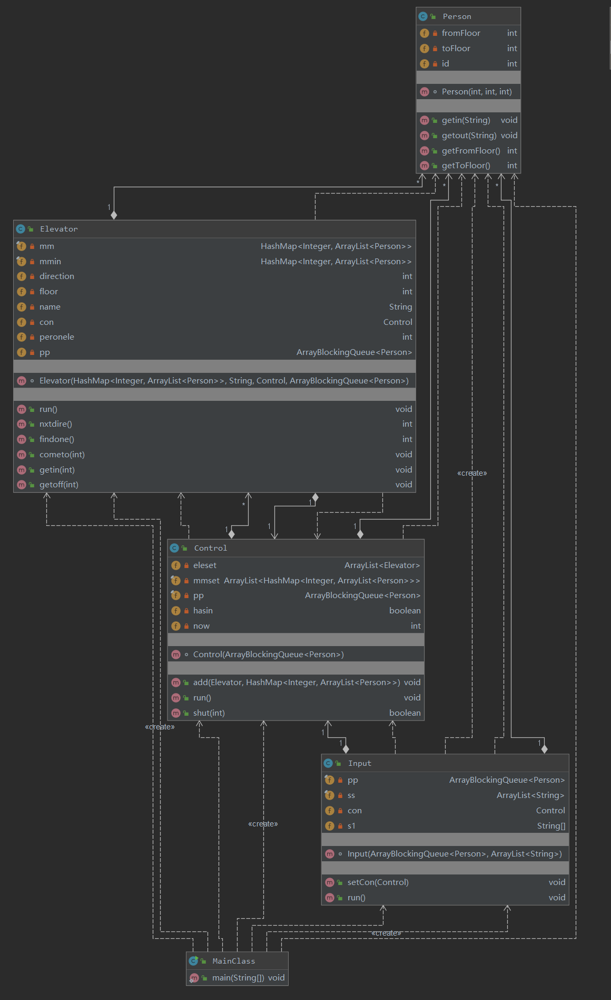
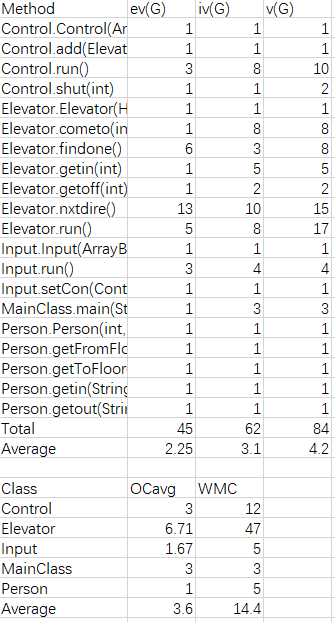
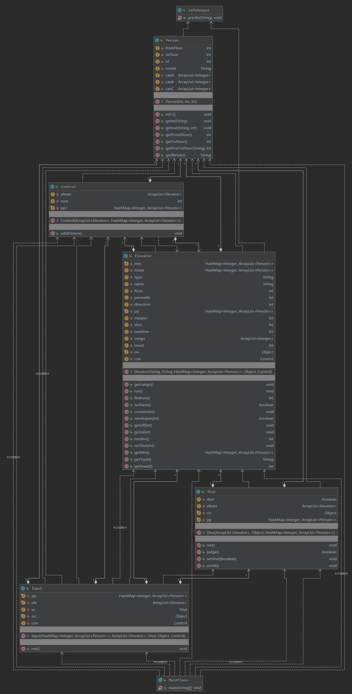
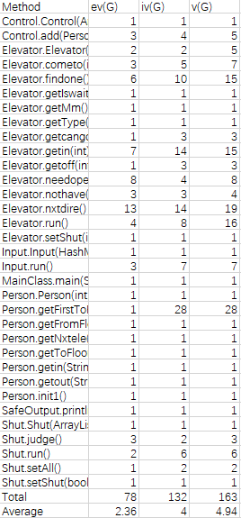
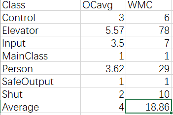

# OO第二单元总结-电梯调度
### 总结
在这三次的作业中，我的架构基本上没有做太大的改变，前两次都是沿用生产者-消费者模式，通过输入线程，电梯线程以及调度器来进行设计，其中并没有讲调度器设置为线程。第三次作业进行了一定的重构，主要的重构是对于电梯线程和输入线程的改变，我没有通过调度器来分配任务，而且通过一个共享对象将电梯与输入联系起来，电梯自由竞争人的方式进行分配。换乘通过电梯与调度器的交互进行分配完成。电梯捎带所采用的算法是LOOK算法。
#### 第一次作业-带捎带的电梯
UML类图：

耦合度：

这一次的作业主要使用了生产者消费者模式，当有新的人使用电梯的时候就将人放入电梯中，第一次作业终于有了一点面向对象的意思了，首先Input只管输入解析，Elevator只管电梯自己的运行以及捎带算法（LOOK），而Control通过一个共享对象将Input和Elevator联系在了一起，Person代表人，人控制自己的上下电梯的行为。但是此次作业因为对于Elevator中方法的抽象没有做得更好，导致最终代码风格仍需改进。
#### 第二次作业-多电梯
UML类图：

耦合度：

这一次作业沿用了上一次作业的设计，但是此次因为多电梯的加入，所以将Control（调度器）设置成为了线程，仍然通过一个共享对象和生产者消费者模式进行电梯-调度器-输入的协调，但此次因为直接平均分配人的原因，导致性能不太好，第三次作业考虑性能因素改进了调度方案，但总体来说可以看出来前两次作业的迭代还是比较成功。
#### 第三次作业-可变电梯，限制可达楼层
UML类图：

耦合度：

时序图：

这一次作业考虑到性能方面的原因，采取了电梯陪跑的方式，即不直接分配给电梯，电梯只会根据共享对象进行调整状态，所以这一次进行了一些重构，只采用了电梯-输入通过共享对象进行交互的方式，其中Control是进行换乘的类，这样性能得到了极大的提升。
**SOLID原则：**
S(单一功能原则)：在第三次作业中，Elevator类管电梯的捎带，运行，输入接受请求，Control类进行换乘分配，Shut类控制程序的结束运行，做到了较好的单一功能原则。
O(开闭原则)：这一次通过三次的迭代，没有做到较好的开闭原则，原因在于第三次进行了部分的重构导致对一些方法进行了扩展修改。
L(里氏替换原则)：这次仿佛没有用到这一原则。
I(接口隔离原则)：这次仿佛没有用到这一原则。
D(依赖反转原则)：第三次作业做到了较好的D原则，这是因为在Elevator，Control等都不依赖于具体的实例，所以达到了较好的D原则。
#### BUG分析：
这三次作业中，在公测和强测均没有出现错误，但是在第二次作业的时候因为对于电梯楼层的错误判断导致因为一个等号在互测中出现了一个错误，整体来说对这三次作业还是比较满意的。
自己在找程序的bug是主要采用的是极端数据以及自动化测试的方法~~（运用cpp，python，java搭建的一个自动化测试）~~，在线程安全方面的问题主要是死锁，但这一问题通过对锁进一步分析即可解决，但是自动化测试复现最多的一个错误是退出线程错误，主要的原因是在换乘的时候，可能导致人所分配到的电梯已经退出，导致错误，发现这一错误我主要通过print进行分析，感觉这一方法可以很快定位错误。这一单元的测试重点主要放在了线程安全方面。
在hack别人方面，也是同样通过自己构造的极端样例以及自动化测试进行hack。
#### 心得体会
首先通过第二单元的学习，对于面向对象我有了更深刻的理解，并且通过三次的迭代时开发也渐渐懂得了一些面向对象编程的好处，而且我觉得对我写自动化评测也有很大的提升，在设计模式方面，通过研讨课和老师的讲解也能够领悟一二，在面向对象编程中如果选对了设计模式，可以使代码简洁明了以及利于开发，总的来说，通过第二单元的学习，算是面向对象便程了吧。

