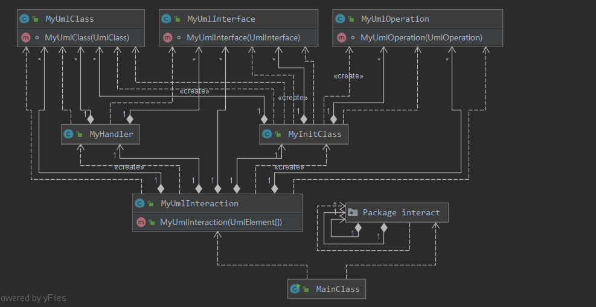

# OO第四单元总结-UML及课程总结
## 第四单元作业架构设计
### 前言
通过第四单元的UML作业的训练不仅仅是对UML有了一定的了解，而且我这三次作业其实就是对UML中的各个元素建立类然后进行抽象，这样的话可以方便查询等操作，所以这也是对面向对象思想的训练。
### 第一次作业
UML类图：

第一次作业主要是对类图进行了解析，本次作业我通过MylnitClass来对相应的数据进行进一步的解析，然后对UmlClass,UmlInterface,UmlOperation进行抽象，将信息储存在每一个类中，然后HashMap数据结构来进行id和对应类的对应存储。本次作业中困难的地方主要是对于各个类别的数据的理解。然后对于相应的查询通过dfs即可实现，这部分的方法我都存储在MyHandler中。
重要数据类型解析：(个人理解
>UML_ATTRIBUTE:即各个类中的属性
>UML_OPERATION：即类或者接口中的方法
>UML_PARAMETER：方法中所需要的参数
>UML_ASSOCIATION：即类之间的关联关系
>UML_GENERALIZATION：泛化关系
>UML_INTERFACE_REALIZATION：类对接口的实现
>UML_ASSOCIATION_END：代表着关联关系各端的信息

### 第二次作业
UML类图：

第二次作业主要是加入了状态图和顺序图的解析，有了第一次的架构以后使得第二次作业的迭代开发相对来说较为轻松，多加了MyUmlinteraction这个类来储存顺序图的相关信息，MyUmlStateMachine这个类储存状态图的相关信息，本次作业还是需要对相关的数据进行理解，下面给出一些重要的数据理解。因为本次作业数据规模不大，仍然采用dfs进行实现，但是例如对于类对应的顶级父类可以采用缓存的方式~~（其实并不影响~~。
重要数据类型解析：(个人理解
>UML_LIFELINE：就是顺序图中类的生命线
>UML_MESSAGE：顺序图中相关类的信息传递
>UML_STATE：状态图中的状态
>UML_PSEUDOSTATE：状态图中的初始状态
>UML_FINAL_STATE：状态图中的结束状态
>UML_TRANSITION：状态图中状态的转移条件

### 第三次作业
UML类图：

第三次作业主要是加入了对异常情况的处理，可以从上图看到，其实架构并没有变，延续了第二次作业的架构，只是对数据进行更加细致的解析。
作业的难点：
- **R001：针对下面给定的模型元素容器，不能含有重名的成员(UML002)：**针对类图中的类**（UMLClass）**，其成员属性**（UMLAttribute）**和关联对端所连接的**UMLAssociationEnd** 均不能有重名
这一项规则的主要难点是对于自关联的理解，如果有自关联，自关联的两个**UMLAssociationEnd**都属于这个类。并且需要注意名字为空的成员不会影响这个规则。
- 其余的一些规则没有什么坑点，只要注意细节就行。

## 四个单元架构设计理解
### 第一单元-表达式求导
在第一单元的学习中，首先是对于JAVA语言进行了进一步的熟悉，并且对于相关的设计模式进行了了解，例如装饰者模式，工厂模式，还学习正则表达式，这一个单元的学习，在前两次作业的架构中都很面向过程，并没有感受到面向对象这种思想的优势所在，但是第三次作业中得到了极大的提升，首先明白了对类的封装，将表达式中的因子抽象出来，然后将相应的操作在抽象出来，最后使用递归的方式进行求导，最后进行化简，但还是有很多不足，最大的不足就是在于对类的抽象不够，并且不能够很好的做到SOLID原则，但是这一个单元让我最大的感受就是面向对象就是要对数据进行抽象，抽象得越好，代码越好写，所以在接下来的单元里，更加懂得了对架构进行分析。
### 第二单元-电梯调度
这一个单元是我面向对象提升最大的一个单元，我觉得能够消费者模式特别适合初学者对面向对象这种思想进行直观的感受。这个单元是对多线程程序的编程，通过对消费者模式的套用，使得这次作业并不需要自己做过多的架构设计，所以这个单元只用去感受面向对象这种思想的优势。所以这一单元体验也是四个单元中体验最好的。
### 第三单元-JML
这一单元主要是对JML这种语言的学习，架构其实已经给出来了，感觉这一单元就是在阅读理解，然后完形填空，其实跟OO思想并没有太大的关系，感觉这一单元主要是对于一种规格化设计的学习。
### 第四单元-UML
这一单元其实就是对OO思想的巩固，在这一单元的学习中，就是在不断地抽象，不断地对数据进行分类管理，在我的理解中这就是OO最重要的东西之一，所以这一个单元虽然并不是很难，但是对于理解面向对象思想有很大的帮助。这一单元的架构其实就是starUML中的架构，就是类的数据放入相应类中，接口数据放入接口中。这也让我对SOLID原则有了更深刻的了解。

## 测试相关
### 对测试的理解
在学习数据结构时，大多数时候只是进行手工造数据，手动测试，然后肉眼debug。但是在OO这门课程的学习中，我逐渐意识到了测试的重要性，OO这几个单元还不算是一个很大规模的工程，但是很多地方都会出现错误，如果仅仅通过肉眼根本无法锁定错误所在，但是如果有了自动化测试，就会更快的定位bug，修复bug，所以测试是很有必要的。
### 测试
在这一学期中，我觉得测试做的最充分的是前两个单元，也是我觉得在测试方面收获最大的两个单元。在第一单元我只会通过cpp这种语言造一些有固定特征的数据，然后进行自动化测试，然后后来学会了python，可以更加随机方便的造数据，并且自动化测试。第二单元测试是最麻烦的，这是因为输出不具有确定性，不能够进行对拍，所以只能自己写测试程序，然后写数据，这一单元的数据大多都是随机的，没有对边界进行测试，我觉得这也是在测试中最大的问题之一，大多数边界情况我都是通过手造数据，这就会出现对边界情况测试不完全的情况，这也是第二单元在互测中我的一个问题。在接下来的三四单元测试中，都采取了Junit和对拍的方式，效果也很好，Junit这种测试方法颗粒度很小，对bug定位也很快。

## 课程收获
OO这门课程我觉得整体来说体验很好，并且对于自己的各方面都有很大的提升，不仅多学习了一门语言，一种思想，各种测试方法，各种设计模式以及各种工具链的使用，更加增加了自己对程序整体的把握，有了面向对象这种思想过后，我感觉对于程序的架构来说有很大的帮助。
在作业方面，有公测，互测，强测，bug修复，有了一种竞赛的刺激的感觉，也是对自己提升最大的方面。
在实验方面，更多的是对理论课上知识的复习以及巩固，相比于作业来说，就没有了那么大的亮点。
在讨论课方面，通过与同学，助教，老师的交流对自己都有很大的帮助，每一次作业的架构设计都能够从讨论课中得到很多的启发，希望这个环节能够越办越好。
最后希望OO能够越来越好，也真诚的感谢助教老师给了我这么好的体验。
## 具体建议
- 第三单元作业：
总感觉JML这个单元与其他四个单元格格不入，也与OO这门课程没有太大的关系，更多的是学习一种规格化设计，JML语言，但是感觉这个东西不用专门花一个单元来学习，感觉可以像正则表达式那样进行学习，并没有必要花三次作业学习，而且第三单元的作业更多的是对算法的考验，感觉第三单元可以尝试改为实验课上的垃圾回收机制，也许会更好。
- 实验课：
每次做完实验课得不到任何的反馈，其实这种感觉总会让心里放不下，不知道自己理解有没有问题，自己做的对不对，希望在实验课后能够给出答案或者给一个大概的分数，比如优秀，良好这种不是很具体的成绩。
- 讨论课：
每次讨论课都感觉助教很厉害，知道很多东西，希望能够有助教进行分享的环节，感觉一定很精彩，也对OO这门课程有很好的帮助。
## 线上学习体会
对我而言，我觉得学习效果好于线下课程，第一是因为课程可以回放，可以二倍速，对于我这种上课容易走神的人来说，这就是一个福利。而且在讨论课，线上提出问题别人也不知道我是谁，所以我会更愿意提出问题。而且这种线上的模式对于作业，实验都没有什么影响，所以我觉得线上很好。

